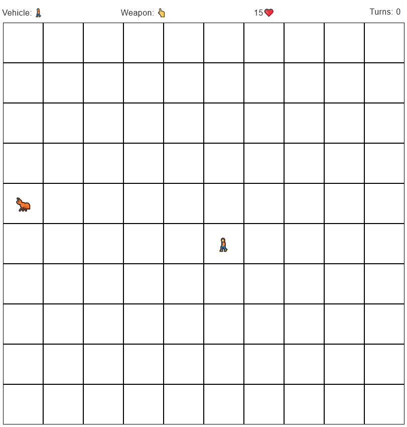
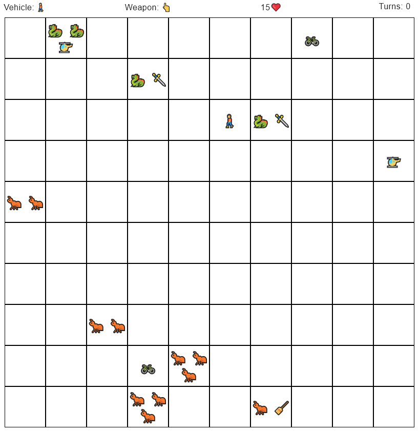
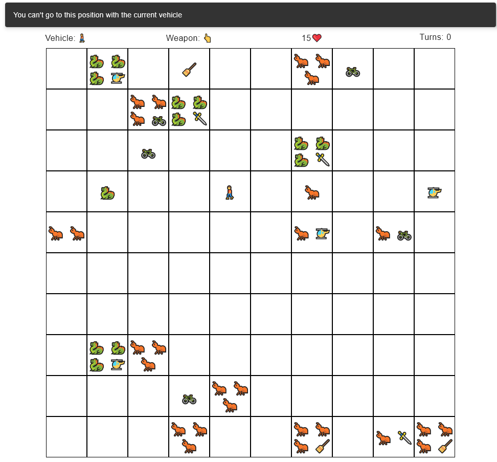

# The plague skeleton
### 2D Rol Game (OOP)

It is a turn-based game in which the following phases or actions follow one another:
1. The user moves the character to a territory he wants to disinfect.

2. The character takes resources to disinfect or travel

3. Disinfection phase

4. Phase of generation of new pests

5. Resource or vehicle generation phase

6. Phase of reproduction of the colonies

7. Phase of expansion of the colonies
---

### **World**
  - Vehicle and article generation ✅

### **Movement**
- **Waling (🚶):** Contiguous square ✅
- **Bicycle (🚲):**  Maximum distance of 4 squares ✅
- **Helicopter (🚁):** Wherever ✅
---
### **Weapons**
- **Hand (👆):** Contiguous square ✅
- **Sword (🗡):**  Maximum distance of 4 squares ✅
- **Broom (🧹):** Wherever ✅
---
### **Enemies**
 - **Dragon (🐉)**
   - **Combat**
     - 🧹 Has no effect ✅
     - 🗡 Decreases the size of the colony by 1 ✅
     - 👆 No effect  
   - **Reproduction** ✅
   - **Expansion** ✅

   
 - **Ants (🐜)**
   - **Combat**
      - 🧹 Eliminates the colony ✅
      - 🗡 Decreases the size of the colony by 1 ✅
      - 👆 Decreases the size of the colony by 2 ✅
   - **Reproduction** ✅
   - **Expansion** ✅

### Player
  - Minus 1 healt on every plague expansion ✅
  - Finish game and display stats ✅

---

### **Screenshots**

